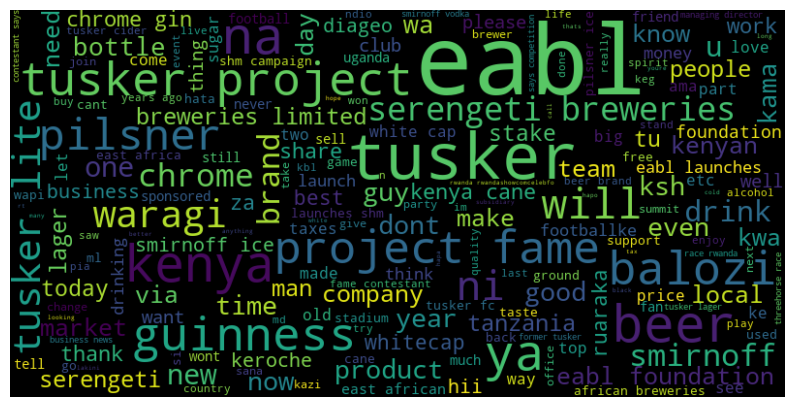
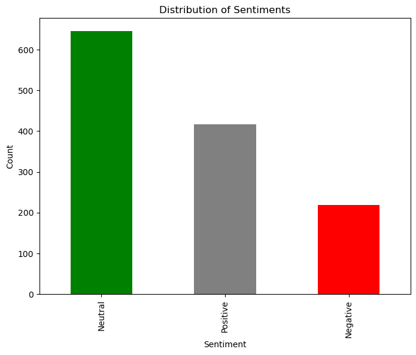

--------------------------------------

## 
<b> EABL STOCK PRICE PREDICTION</b> 

=======================================

## Overview
East African Breweries Limited (EABL) has a rich history rooted in East Africa's economic and social fabric. Established in 1922, EABL has grown to become a leading beverage company, contributing significantly to the region's economy. Over the years, EABL has built a portfolio of iconic brands, becoming synonymous with quality and innovation in the brewing industry.EABL holds a pivotal role in the East African beverage market, offering a diverse range of alcoholic and non-alcoholic products. Its flagship brands, including Tusker Lager and Guinness, have become household names, reflecting the company's commitment to quality craftsmanship.

## Motivation
The Kenya Finance Act 2023 came up with new tax reforms laws that saw the **Kenya Revenue Authority** demand more from EABL. The taxman puts EABL  at a tight spot because of the requirement to remit taxes within 24hrs after any consignment of their products leave their storage. This uncondusive environment for doing business casts doubts amongst investors and shareholders alike because of the uncertainity that lies ahead. This harsh tax directive has forced them to depend on day-to-day loans from banks to comply with the rules. 

## Resources
### IDE, Language, Files
 - Editors: Jupyter Notebook, VSCode, Google Colab (https://colab.research.google.com/)
-  Python version: Python 3.9
-  Code: main.ipynb, streamlit.py
### Python Packages Used
- Data Manipulation: Pandas, Numpy.
- Data Visualization: Matplotlib, Seaborn
- Modeling: Sklearn, XGBoost
- Sentiment Analysis: vaderSentiment
- UI: Streamlit

## EDA
- Volatility Analysis - To calculate the daily returns of EABL's stock.

- Trend Analysis - To examine the historical price data to identify  prevailing trends, seasonal patterns and any potential autocorrelation in the stock price overtime.

- Autocorrelation Analysis - To determine  the correlation of stock prices with past values.

- Trade Spike Analysis - To identify and understand instances where EABL's trading volume deviates significantly from it's typical levels.

- Dividend Analysis - To undestand the trends and patterns of EABL's dividend payouts.

## Sentiment Analysis
- Scrape twitter sentiments about EABL using nitter scraper(https://pypi.org/project/nitter/). 
To scrape tweets, run the scripts in the **Scrapers** directory independently while changing the search term in the **get_tweets** function then specify the term and length. The scripts can be found at [Tweeter scrappers](Scrapers)
NB: Nitter scrapper has a limit of 80 tweets per session because after that it throws an error.
.png>)
- Concat and merge all EABL sentiments into a single dataframe for easier analysis. 
- Perform a sentiment analysis as well as visualize the most common set of topics discussed an dtheir respective distributions.
 
 

## Modelling
**Goal:** Develop a robust time series model to forecast the **Closing, High, Low and Open** EABL stock prices leveraging the use of market indicators to get better predictions. 

**Challenge:** High multicollinearity between the prices. 

**Alternative:** Shift the objective to classification by applying shifting to each of the prices one day foraward to capture short term trends and momentum. For every change in price, mark it as 1 else, 0.

Use a multiclass output classifier to predict the probability of occurence of any of the classes. 

**Challenge:** You must have a threshold value that sets the confidence levels or points above and below which a prediction will be considered to rise or not. To get a sensible & reccommended threshold all while balancing between the **TPR & FPR**, plot the **ROC Curve** and by visual inspection, find a balance. The ROC plot as well as the scores for the final deployed model can be found [here](test.ipynb). 

To get the perfect model for deployment, apply tuning iteratively, with the aim of improving the precision scores of the various classes. The final model should support multioutput classification or alternatively you can use a Scikit-learn wrapper(https://scikit-learn.org/0.21/modules/generated/sklearn.multioutput.MultiOutputClassifier.html) that supporrts such outputs. All boosting algorithms support multioutputs. 

The final model had an average F1 score of 85% at a threshold value of 0.8. This score was chosen as our evaluation metric because it offers a balance between the **False negatives** & **False Positives**. 

A False negative would mean a certain price is meant to increase but the model predicts that it will not, potentially resulting in missed investment opportunities. Conversely, a false positive occurs when the model predicts an increase in price where there isn't one, leading to potentially misguided investment decisions. Therefore, the F1 Score, by considering both precision and recall, provides a comprehensive evaluation of the model's performance, helping to strike a balance between these competing concerns and ultimately improving the reliability of investment decision-making. 

## Deployment
.png>)
The app can be found on (https://dsc-capstone-projectfinale-fiheu7mawjihsmxmnfw2wj.streamlit.app/)
Create a copy of the original dataframe for easier manouevre, perform all cleaning and pre-processing in an OOP class to minimize data leakage. Include the modelling steps in the class using the model that achieved the best score after tuning. The model that had the best score in our case was the XGBoost model which learns patterns around data pretty quick. 

Save the model to a pickled file as outlined step by step in [deployment model](model1.py) then create a streamlit file for deployment while importing the necessary and required libraries. 
* Import the file name with the name of class used.
* Create a requirements.txt file with the respective library versions to avoid conflicts. The libraries used in this project include:
1. xgboost==2.0.0
2. joblib==1.2.0
3. streamlit==1.30.0
4. scikit-learn==1.2.2

They can be found in the file [requirements](requirements.txt)

Create an account on streamlit to allow for deployment. To build a more robust model that is applicable in any event, we did away with the date column because of the need of bulding a model that is adoptable in any kind of future scenarios without the limitation of time. 

To improve the UI, the user only needs to input the previous **High, Open and low** prices to determine the next future stock prices. The user won't be constrained by time frames. 

## Contribution
To contribute to this project:

* Clone the repo.
* Create your own branch.
* Navigate to (https://www.eabl.com/share-price-performance) to get the latest share price history starting from February 2024.
* Copy and paste the prices on the **Final_merge CSV** found [here](MergedData).
* Rerun the [main notebook](main.ipynb), [model1 python file](model1.py), [save model script](save_model.py), and finally [streamlit file](streamlit.py) to get reproducible results. 